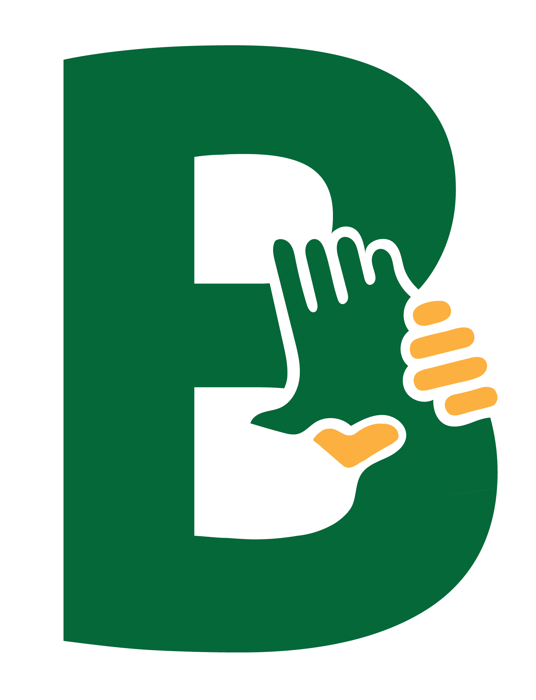

<div align="center">
    <div>
        
    </div>
    <div>
        <h3><b>BaikBareng</b></h3>
        <p><i>Bantu Tepat. Bareng Hebat</i></p>
    </div>      
</div>

<br>

<h1 align="center">BaikBareng - Platform Transparan & Cerdas untuk Program Bansos Indonesia 🇮🇩</h1>

<div align="center">

</div>

<br>

BaikBareng adalah platform teknologi sosial berbasis AI dan blockchain untuk mengelola, memverifikasi, dan mendistribusikan bantuan sosial (bansos) secara adil, transparan, dan tepat sasaran di seluruh Indonesia.

Meningkatkan efektivitas dan efisiensi penyaluran bansos dengan memanfaatkan teknologi AI untuk rekomendasi penerima yang layak, serta teknologi blockchain untuk menjaga transparansi dan integritas data bantuan sosial di seluruh ekosistem digital Indonesia.

---

## 📃 Table of Contents

- [Complete Documentation](#-complete-documentation)
- [Technology Stack](#-technology-stack)
- [Core Features](#-core-features)
- [Live Demo](#-live-demo)
- [Getting Started Locally](#-getting-started-locally)
- [env Configuration](#-env-configuration)
- [Website Preview](#-website-preview)
- [Diagrams](#-diagrams)
- [Team](#-team)
- [Contact](#-contact)

---

## 📚 Complete Documentation

<ul>
    <li><b>Notion Full Documentation</b></li>
    <a href="https://stanley-n-wijaya.notion.site/BaikBareng-Documentation-22573555b71f8093bd71c7434d27e617?source=copy_link">BaikBareng Notion</a>
    <li><b>Pitch Deck</b></li>
    <a href="https://www.canva.com/design/DAGsBM1mVy8/nLLaXe3aM2Vewyik1Q7LYA/edit?utm_content=DAGsBM1mVy8&utm_campaign=designshare&utm_medium=link2&utm_source=sharebutton">BaikBareng Pitch Deck</a>
    <!-- <li><b>Demo Video</b></li>
    <a href="https://youtube.com/baikbareng-demo">YouTube Demo</a> -->
</ul>

---

## ⚙️ Technology Stack

<div align="center">

<kbd></kbd>
<kbd></kbd>
<kbd></kbd>
<kbd></kbd>
<kbd></kbd>
<kbd></kbd>
<kbd></kbd>
<kbd></kbd>
<kbd></kbd>
<kbd></kbd>
<kbd></kbd>
<kbd></kbd>
<kbd></kbd>

</div>

<div align="center">
<h4>React | Vite | TypeScript | Tailwind CSS | Shadcn UI | Supabase | HuggingFace | Python | Flask | OpenAI | Solidity | Ethereum | Lisk</h4>
</div>

---

## 🧩 Core Features

### 🧠 Sistem Kelayakan Berbasis AI
- Model Penilaian Keadilan menggunakan data sosial ekonomi
- Rekomendasi penerima yang didukung Pembelajaran Mesin
- Pengurangan bias dan prioritas yang adil

### 🛡 Transparansi Blockchain
- Catatan on-chain setiap penerima yang disetujui
- Kontrak pintar yang tidak dapat diubah untuk perjanjian pencairan bantuan
- Jejak audit dan buku besar publik yang dapat diverifikasi

### 📝 Registrasi Cerdas
- Registrasi tanpa kertas dengan ID digital & e-KYC
- Pengambilan dokumen & verifikasi rumah berbasis geolokasi
- Integrasi bot WhatsApp untuk aksesibilitas

### 📊 Dasbor Pemerintah & LSM
- Analisis waktu nyata dan pelacakan penerima manfaat
- Visualisasi dampak & wawasan distribusi dana
- Antarmuka manajemen bantuan multi-program

### 🔄 Pelacakan Status Penerima Manfaat
- Pemeriksaan ulang kelayakan berbasis AI
- Status pengiriman dan log penggunaan (makanan, uang tunai, barang)
- Notifikasi untuk perpanjangan, penolakan, atau pembaruan

---

## 🚀 Live Demo

👉 [https://baikbareng.id/](https://baikbareng.id/)

---

## 🧰 Getting Started Locally

### Prasyarat

- **Node.js** (v18+)
- **Akun Supabase**
- **Dompet Polygon atau Chainlink (Testnet)**
- **Python 3.10+** (Untuk Server AI)
- **Dompet IDRX untuk pengujian kontrak pintar**

### Kloning Proyek

```bash
git clone https://github.com/BaikBareng-id/BaikBareng-App.git
cd baikbareng-app
npm install
npm run dev
```

---

## 🔐 .env Configuration

.env for the Client Side Service
```
VITE_SUPABASE_URL=
VITE_SUPABASE_ANON_KEY=
```

---

## 📸 &nbsp;Website Preview
<table style="width:100%; text-align:center">
    <col width="100%">
    <tr>
        <td width="1%" align="center"></td>
    </tr>
    <tr>
        <td width="1%" align="center">Landing Page</td>
    </tr>
    <tr>
        <td width="1%" align="center"></td>
    </tr>
    <tr>
        <td width="1%" align="center">BaikBareng Feature Page</td>
    </tr>
    <tr>
        <td width="1%" align="center"></td>
    </tr>
    <tr>
        <td width="1%" align="center">Bansos Page</td>
    </tr>
    <tr>
        <td width="1%" align="center"></td>
    </tr>
    <tr>
        <td width="1%" align="center">Public Data Page</td>
    </tr>
    <tr>
        <td width="1%" align="center"></td>
    </tr>
    <tr>
        <td width="1%" align="center">Login Page</td>
    </tr>
    <tr>
        <td width="1%" align="center"></td>
    </tr>
    <tr>
        <td width="1%" align="center">All Features Page</td>
    </tr>
    <tr>
        <td width="1%" align="center"></td>
    </tr>
    <tr>
        <td width="1%" align="center">User Dashboard Page</td>
    </tr>
</table>

---

## 🧭 Diagram

*Overall Database System Flow:*
<p align="center">
  
</p>

Diagram ini menunjukkan bagaimana model terhubung menggunakan Diagram ERD

---

## 👥 Owner

Repository ini dibuat oleh
<ul>
<li>Stanley Nathanael Wijaya</li>
<li>Clarissa Aditjakra</li>
<li>Muhammad Zidan Fatoni</li>
<li>Cathlyn Shanice Dharmawan</li>
</ul>
Sebagai Project Hackathon untuk BI-OJK Hackathon 2025

---

## 📬 Contact
Punya pertanyaan atau ingin berkolaborasi?

- 📧 Email: stanley.n.wijaya7@gmail.com
- 💬 Discord: `stynw7`

<code>Made with ❤️ by Kantor BaikBareng Team</code>